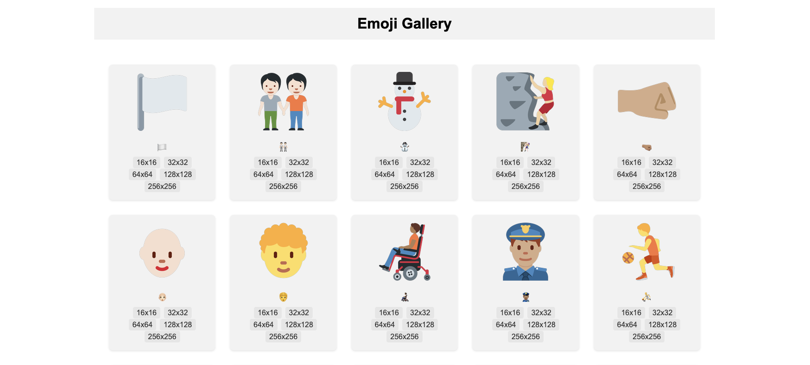

A static website that holds and serves emojis. Useful when you need a big emoji in image format or when you want to quickly set up a favicon for your webpage.

## 🖼️ Gallery

[](gallery)

To browse all images go to [emoji gallery](https://cemreefe.github.io/static-emoji-images/gallery.html)

## 📜 Parameters

We store emojis in various sizes from 16x16 to 256x256. We have two parameters in our URLs, size and emoji.

`https://emoji.dutl.uk/png/<size>/<emoji>.png`

## 🍣 ️ Accessing raw images

1. Choose an emoji of your chioce (i.e. 🐬)
2. Go to https://emoji.dutl.uk/png/64x64/🐬.png
  
3. Enjoy!

## 💙 Using emojis as favicons

Add the following line in the `<head>` section of your html file

```
<link rel="icon" 
      type="image/png" 
      href="https://emoji.dutl.uk/png/64x64/🐬.png">
```

## 🍄 Example

See my personal blog!

[https://cemrekarakas.com/](https://cemrekarakas.com/)

